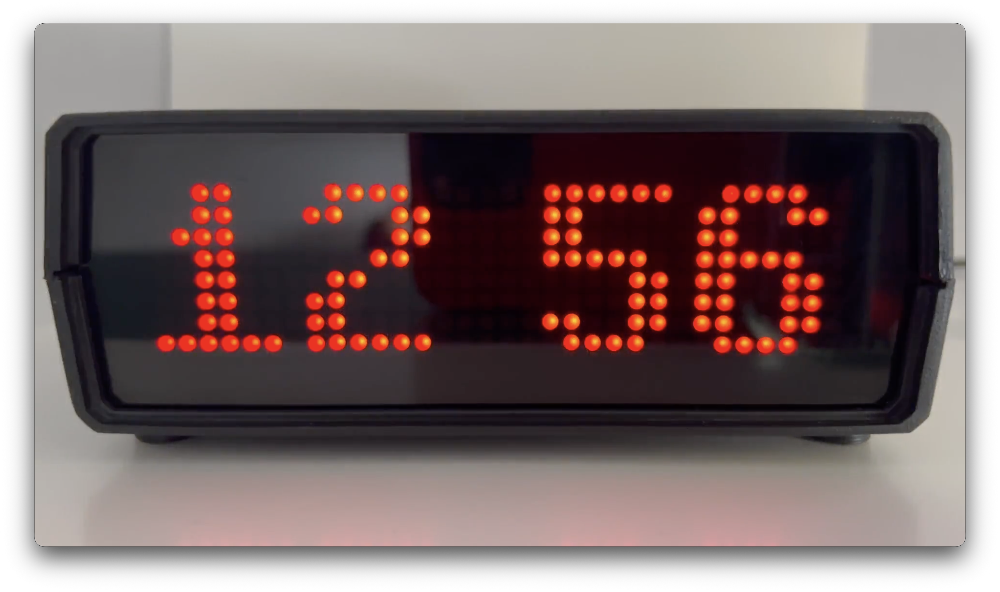
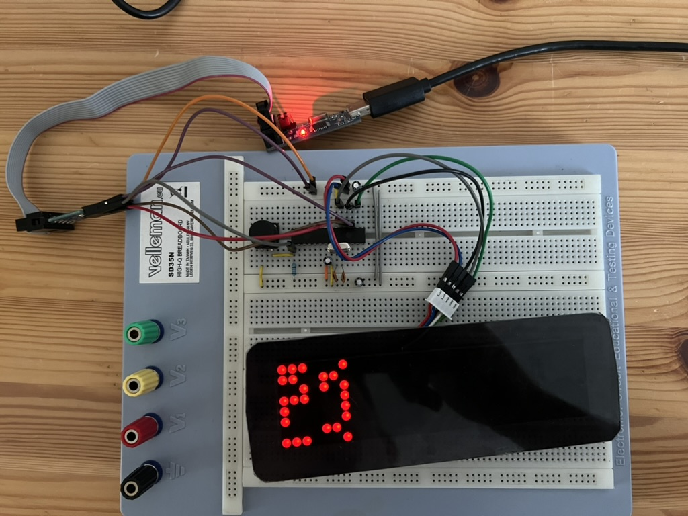
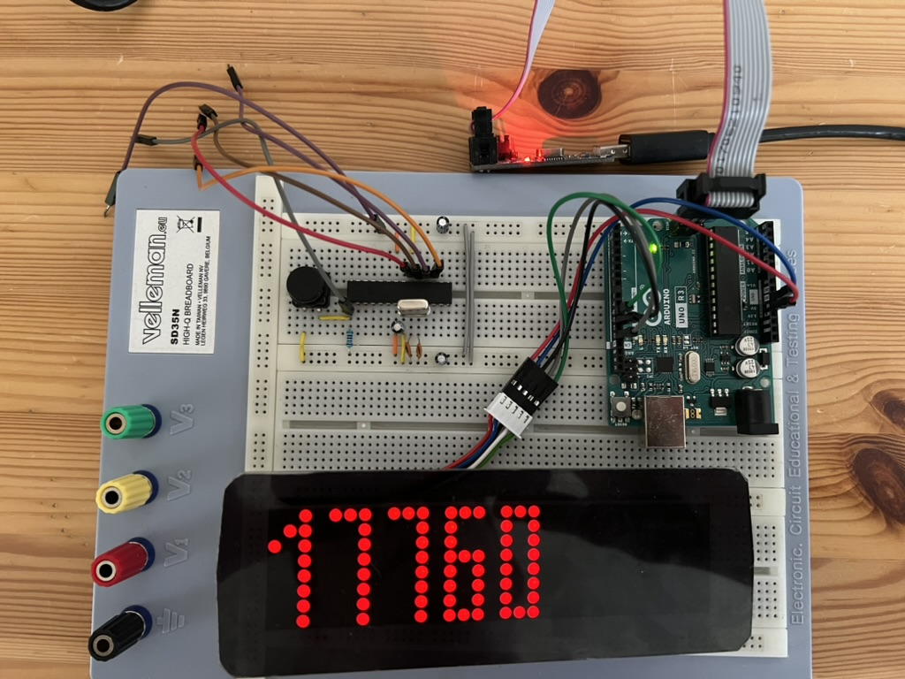

# AVR-Based Digital Clock

[](LICENSE)
[](LICENSE-hardware)
[](#hardware)

A bare-metal digital clock running on a **standalone ATmega328P** with a
**DS3231** RTC for timekeeping. It's a from-scratch, no-Arduino rewrite of the
[GPS synchronized clock](https://github.com/kuzm1nsk1/arduino_GPS_synchronized_clock):
direct register access, custom peripheral drivers, and a rotary-encoder menu on a 32×8 LED matrix.



## Features

- 32×8 LED matrix display
- Adjustable display brightness
- Temperature display (TMP36)
- Simple, intuitive time and alarm setting
- Speaker for the alarm
- Settings retained across power loss (EEPROM)

## Repository layout

```
firmware/    bare-metal C sources, drivers, and Makefile
hardware/    bill of materials
docs/        datasheets and demonstration video
```

## Hardware

Standalone ATmega328P (16 MHz crystal). Full parts list:
[hardware/bom.csv](hardware/bom.csv).

| Ref | Qty | Part | Value |
|-----|-----|------|-------|
| U1 | 1 | ATmega328P | — |
| U2 | 1 | DS3231 | RTC module |
| U3 | 1 | MAX7219 matrix | 32×8 |
| U4 | 1 | TMP36 | Temp sensor |
| Y1 | 1 | Crystal | 16 MHz |
| C1–C2 | 2 | Capacitor | 22 pF |
| C3–C6 | 4 | Capacitor | 100 nF |
| C7 | 1 | Electrolytic | 10 µF |
| R1–R2 | 2 | Resistor | 4k7 |
| R3–R4 | 2 | Resistor | 10k |
| SW1 | 1 | Pushbutton | — |
| J1 | 1 | DC barrel jack | — |
| — | 1 | Rotary encoder | — |

Datasheets: [ATmega328P](docs/datasheets/atmega328p_datasheet.pdf) ·
[DS3231](docs/datasheets/ds3231_datasheet.pdf) ·
[MAX7219](docs/datasheets/max7219_datasheet.pdf) ·
[MAX7219 matrix](docs/datasheets/max7219_matrix_module_datasheet.pdf) ·
[TMP36](docs/datasheets/tmp36_datasheet.pdf)

### Schematic


## Firmware

Bare-metal C with per-peripheral driver modules (MAX7219, DS3231, TMP36, rotary
encoder). Build and flash instructions: see [firmware/README.md](firmware/README.md).

```sh
cd firmware
make            # build -> avr_clock.hex
make flash      # program via avrdude
```

## Usage

The rotary encoder drives everything — rotate to move/adjust, press to select.

- From the clock face, **rotate** to cycle the menu: `CLK` (set time), `ALRM`
  (set alarm), `BRT` (brightness), and back to the time.
- **Press** to enter the highlighted item.
- **Set time / alarm:** rotate to change the value; the first press moves from
  minutes to hours; the next press confirms and returns to the clock.
- **Brightness:** rotate to change (0–15); press to save to EEPROM and return.
- The temperature is shown briefly every so often between time updates.
- When the alarm fires, the display flashes and the buzzer sounds; **press the
  encoder** to silence it.

## Demonstration

https://github.com/user-attachments/assets/a4d47e3d-2e19-4f5e-987f-0afac1b2c268

A local copy of the clip is in [docs/avr_clock.mp4](docs/avr_clock.mp4).

## Troubleshooting

Standalone ATmega328P circuit:



Arduino Uno used in place of a bare ATmega328P:



**Symptom:** the display shows random characters.
**Fix:** a faulty ATmega328P — replace the microcontroller.

## License

- **Firmware:** MIT — see [LICENSE](LICENSE)
- **Hardware** (schematic, layout): CERN-OHL-W v2 — see [LICENSE-hardware](LICENSE-hardware)
- **Docs & media** (video, diagrams): CC-BY-4.0 — see [docs/LICENSE](docs/LICENSE)
